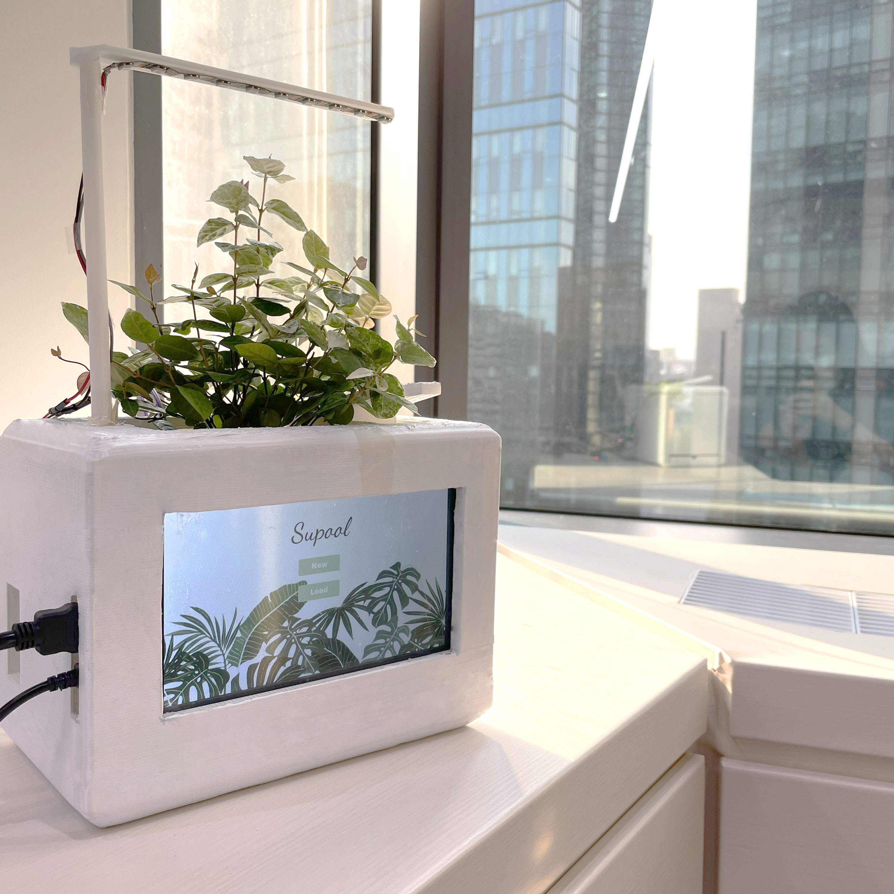
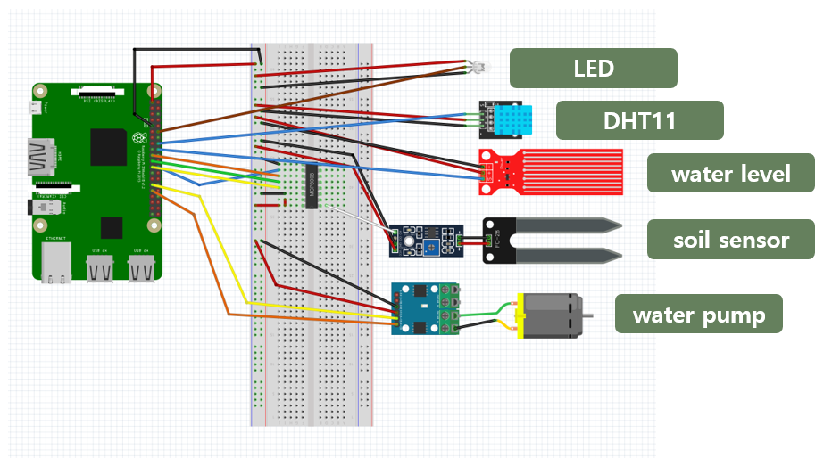
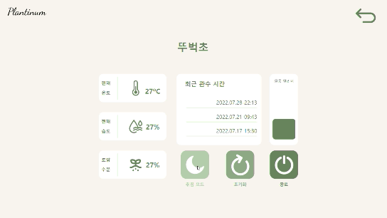
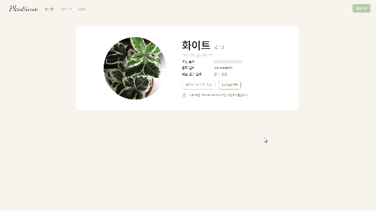
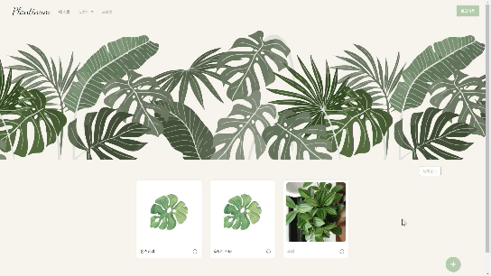
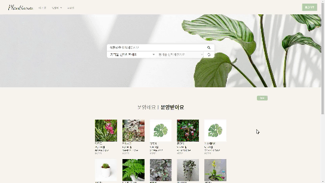
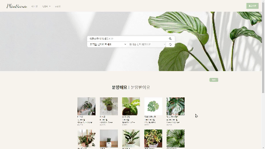
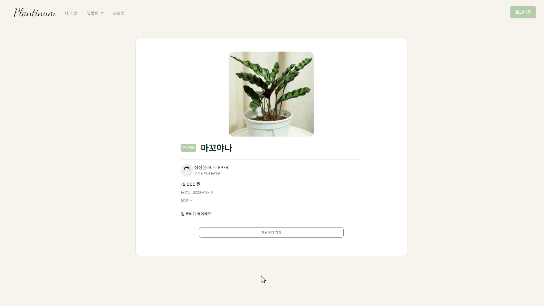
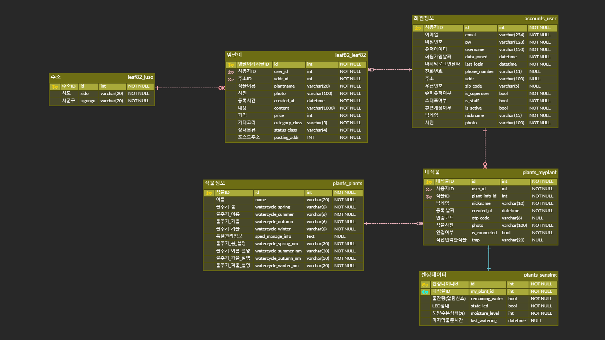

# 🍀PLANTINUM

<div align="center">
  
</div>


**PLANTinum** 이란 **Plant**와 **Platinum**의 합성어입니다. 또한, **Plan**이라는 단어를 담고 계획적으로 식물을 관리하고 보살핀다는 의미를 나타냅니다. 본 프로젝트는 반려식물을 자동으로 케어해주고 나아가 웹을 통하여 반려식물을 거래할 수 있는  **IoT-플랫폼 서비스**를 제공합니다.
Plantinum은 크게 두 가지 서비스로 이루어져 있습니다.


## 1. IoT

플랜티넘의 IoT 기기 Supool수풀입니다.
Supool의 이름은 **나무와 식물이 우거진 곳**이라는 뜻의 수풀에서 유래했습니다.

### 기능

> 실시간으로 흙의 습도를 측정
> 
> 자동 급수를 진행
>
> LED 식물등
> 
> LCD 터치스크린을 통한 모니터링
> 
> Plantinum, mySQL 웹과 연동


### IoT 기기 구성


<details>
<summary > <b>기능 자세히 보기</b></summary>
<div markdown="1">

[Plantinum 디바이스 시연 영상](https://youtu.be/C1uGjrZCowk)



> 사용 센서 : LCD, 모터 드라이브(L9110S), 워터펌프, DHT11, 네오픽셀 LED, 수위센서(접촉식), 토양수분센서, mcp3008(컨버터)


> supool 3D 도면

</div>
</details>


### LCD 화면 구성

<details>
<summary > <b>기능 자세히 보기</b></summary>
<div markdown="1">


> new 버튼 클릭 시 OTP 입력으로 WEB과 연동
> 
> OTP는 웹의 내식물 상세 페이지에서 확인 가능 (Supool 연동)
  


> load 버튼 클릭 시 supool에 저장되어 있는 정보 불러오기


> 메인 페이지에서 파도의 높이로 토양 습도 확인
> 
> 디테일 페이지에서 주변환경의 온습도, 토양 수분, 최근 관수 시간, 물통 잔여량 확인



> 절전모드 버튼 클릭 후 5초 뒤 절전모드
> 
> 화면 터치 시 메인페이지로 이동

</div>
</details>

<br>


[상세 코드](https://github.com/jina0924/Plantinum_vol2/tree/master/HW/Supool) /
[실행법](https://github.com/jina0924/Plantinum_vol2/blob/master/exec/%EA%B3%B5%ED%86%B5PJT_%EC%84%9C%EC%9A%B81%EB%B0%98_A109_%ED%8F%AC%ED%8C%85%EB%A7%A4%EB%89%B4%EC%96%BC.pdf) /
[기술 스택](https://github.com/jina0924/Plantinum_vol2/blob/master/Docs/STACK_EXPLANATION.md)


## 2. WEB

웹은 크게 세 가지 서비스를 제공합니다.

### 회원가입 및 프로필

<details>
<summary > <b>기능 자세히 보기</b></summary>
<div markdown="1">


> 회원 가입
>
> 최초 회원가 입시 닉네임 자동 생성


> 닉네임, 이메일, 연락처, 주소, 프로필 이미지 변경
>
> 회원가입 후 경과일 확인
>
> 작성한 판매, 구매 게시글 확인
>
> 회원 탈퇴


> 비밀번호 변경

</div>
</details>

<br>

### 내 식물

<details>
<summary > <b>기능 자세히 보기</b></summary>
<div markdown="1">


> 식물 리스트로부터 식물 선택
>
> 존재하지 않는 식물은 사용자가 직접 작성
>
> 반려 식물의 닉네임 지정




> 계절별 관리 정보와 특별 관리 정보 제공
>
> SuPool 연결 버튼을 통해 60초 동안 임시 비밀번호 발급, IoT 기기와 웹페이지 연결
>
> 연결 후 웹페이지에서 토양습도와 최근 관수 날짜확인 가능




> 등록순, 이름순 조회
</div>
</details>

<br>

### 잎팔이

<details>
<summary > <b>기능 자세히 보기</b></summary>
<div markdown="1">



> 판매, 구매 게시글 등록 및 조회




> 식물명, 지역별 게시글 검색
>
> 게시글은 20개씩 추가 조회




> 거래자 간 채팅
</div>
</details>

<br>
<br>
<br>

<details>

<summary > 상세 코드는 여기로 </summary>
<div markdown="1">


### (1) BE

[상세 코드](https://github.com/jina0924/Plantinum_vol2/tree/master/BE) /
[실행법](https://github.com/jina0924/Plantinum_vol2/blob/master/exec/%EA%B3%B5%ED%86%B5PJT_%EC%84%9C%EC%9A%B81%EB%B0%98_A109_%ED%8F%AC%ED%8C%85%EB%A7%A4%EB%89%B4%EC%96%BC.pdf) /
[기술 스택](https://github.com/jina0924/Plantinum_vol2/blob/master/Docs/STACK_EXPLANATION.md)

### (2) FE
[상세 코드](https://github.com/jina0924/Plantinum_vol2/tree/master/FE/plantinum) /
[실행법](https://github.com/jina0924/Plantinum_vol2/blob/master/exec/%EA%B3%B5%ED%86%B5PJT_%EC%84%9C%EC%9A%B81%EB%B0%98_A109_%ED%8F%AC%ED%8C%85%EB%A7%A4%EB%89%B4%EC%96%BC.pdf) /
[기술 스택](https://github.com/jina0924/Plantinum_vol2/blob/master/Docs/STACK_EXPLANATION.md)


</div>
</details>


---


## 💾설치

사이트 주소 : [Plantinum](http://plantinum.co.kr)

> 자세한 내용은 [포팅 매뉴얼](./exec) 참고

- FE
> 파일 위치 : ./FE/plantinum
```shell
// 배포용 설치
$ npm run build

// 로컬에서 이용시 설치
$ npm i
$ npm run serve
```

- BE
> 파일 위치 : ./BE/back

```shell
$ python manage.py runserver
```


- CHAT

> 파일 위치 : ./BE/chat
```shell
$ nohup node app.js &
```


## 🌸 IoT

[코드정보](./HW/Supool)

### [Supool](./HW/Supool)
> 라즈베리파이에 다운로드 후 폴더 내에서 다음 명령어 실행
```shell
$ python main.py
```

### [외관](./HW/stl_files)
> SuPool의 외관 3D 디자인


## 🌸WEB 
### 🌻FE
[코드정보](./FE/) 참고

>  [플랜티넘 폴더](./FE/plantinum/)에서 vscode 실행 후 api 연결 포트 선택

```js
// /FE/plantinum/src/api/drf.js

// 로컬에서 실행할 경우
const HOST = 'http://127.0.0.1:8000/api/v1/'

// 배포용 api 주소
// const HOST = 'http://plantinum.co.kr/api/v1/'
```


### 🌻BE
[api 가이드 문서.md](./BE/api%20%EA%B0%80%EC%9D%B4%EB%93%9C%20%EB%AC%B8%EC%84%9C.md) 참고

[채팅 서버 구축 문서.md](./BE/uwsgi%EB%A5%BC%20%EC%9D%B4%EC%9A%A9%ED%95%B4%EC%84%9C%20django%EC%99%80%20nginx%EC%97%B0%EA%B2%B0%ED%95%98%EA%B8%B0.md) 참고


## 🎮기술스택
[기술스택정리문서](./Docs/STACK_EXPLANATION.md)


## 📃Docs
[문서 모음](./Docs/)
> [프로젝트_명세서](./Docs/%5B%ED%94%84%EB%A1%9C%EC%A0%9D%ED%8A%B8_%EB%AA%85%EC%84%B8%EC%84%9C%5DPlantinum.docx) : 프로젝트가 수행해야 할 모든 기능과 제약 사항, 서비스적인 요구사항을 분석해서 기록해둔 문서

> [HW 흐름 구상 및 유즈케이스.docx](./Docs/HW%20%ED%9D%90%EB%A6%84%20%EA%B5%AC%EC%83%81%20%EB%B0%8F%20%EC%9C%A0%EC%A6%88%EC%BC%80%EC%9D%B4%EC%8A%A4.docx) : 하드웨어 흐름 구상도

> [Jira_guide.pdf](./Docs/Jira_guide.pdf) : Jira 사용법 정리

> [STACK_EXPLANATION](./Docs/STACK_EXPLANATION.md) : 기술 스택 정리


## 💿ERD
 [ERD](https://www.erdcloud.com/d/BqMQqe8yrRaQ5PXyd)


